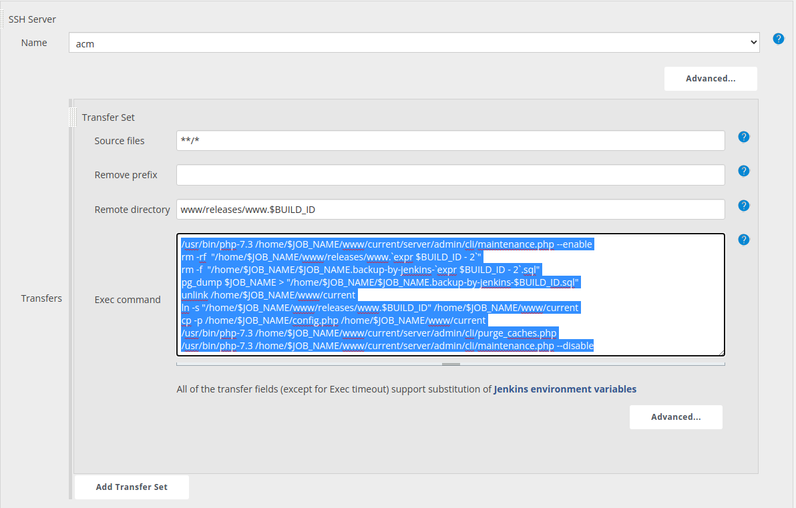

# PHP code deploy with Jenkins (Publish Over SSH) 

# Task Description :
* Deploy sample php application.
* store the source code in one of the repository
* deploy the latest code
* create a pipeline in jenkins to deploy it on server with publish over SSH.

---

## Steps:
we must have two servers. One for Jenkins and another one for the running the commands with ssh.

Once we will be having Jenkins ready, we need to setup one pipeline which will be used to for two things.

- Creating backup of code of last two builds and
- Enabling the maintainance mode during build.

We have two ways to run this pipeline.

# 1. With Jenkins Node

we can run the pipeline by using the second server as node of jenkins with the given script.

```sh
sudo bash backup.sh
sudo sed -i '/maintenance.conf/s/^#//' /etc/apache2/sites-available/000-default-le-ssl.conf
sudo systemctl reload apache2
sleep 10
sudo cp -rf ./* /var/www/html
sudo sed -i '/maintenance.conf/s/^/#/' /etc/apache2/sites-available/000-default-le-ssl.conf
sudo systemctl reload apache2
```
Here `backup.sh` file is used to create backup of last two builds that can be used for rollback in future.

# 2. Publish over ssh

We can use `publish over ssh` approach to run the script on remote server.

- Install “Publish Over SSH Plugin 1.11” at Plug-in page.

Now 

Configure :

- Click “Manage Jenkins”
- Click “Configure System”
- Go to “Publish over SSH” section
- Enter “/Users/Shared/Jenkins/.ssh/id_rsa” to “Path to Key”
- Click “Add” at “SSH Servers”
- Enter any logical name to “Name”
- Enter IP Address or Hostname of the server to “Hostname”
- Enter the user name to login to “Username”
- Enter any directory to “Remote Directory”
- Click “Test Configuration”
- Click “Save” at bottom of the page


Now,

We can configure our pipeline.

- Choose the scm option for source code and provide the required details.
- In the build section opt for `Send files or execute commands over SSH
`.
- Provide the required details like the script provided above. Image for your reference below.



- Save it and Build it.

---

# **Thank You**

I hope you find it useful. If you have any doubt in any of the step then feel free to contact me.
If you find any issue in it then let me know.

<!-- [](https://www.linkedin.com/in/choudharyaakash/) -->


<table>
  <tr>
    <th><a href="https://www.linkedin.com/in/choudharyaakash/" target="_blank"><a/></th>
    <th><a href="mailto:choudharyaakash316@gmail.com" target="_blank"><a/>
</th>
  </tr>
</table>

